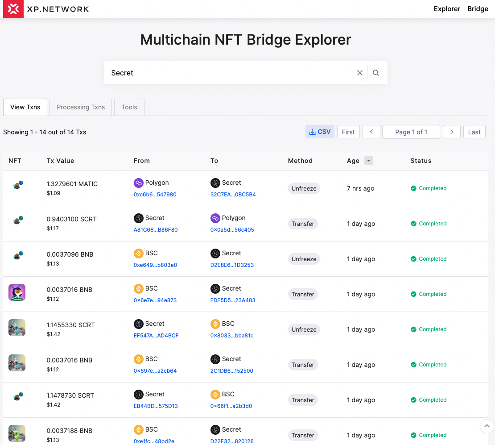
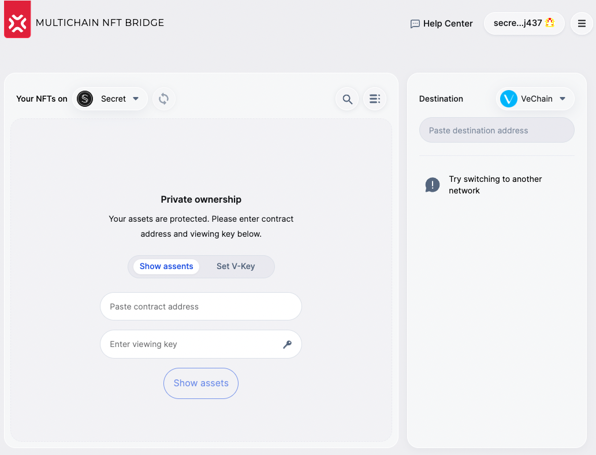
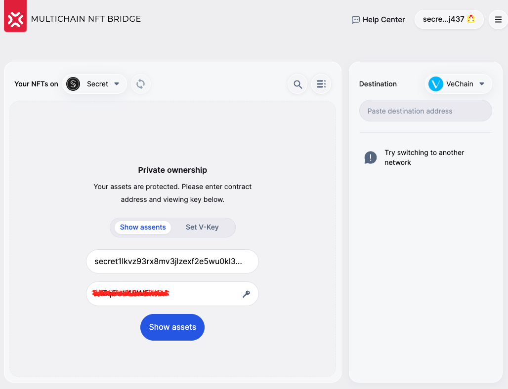
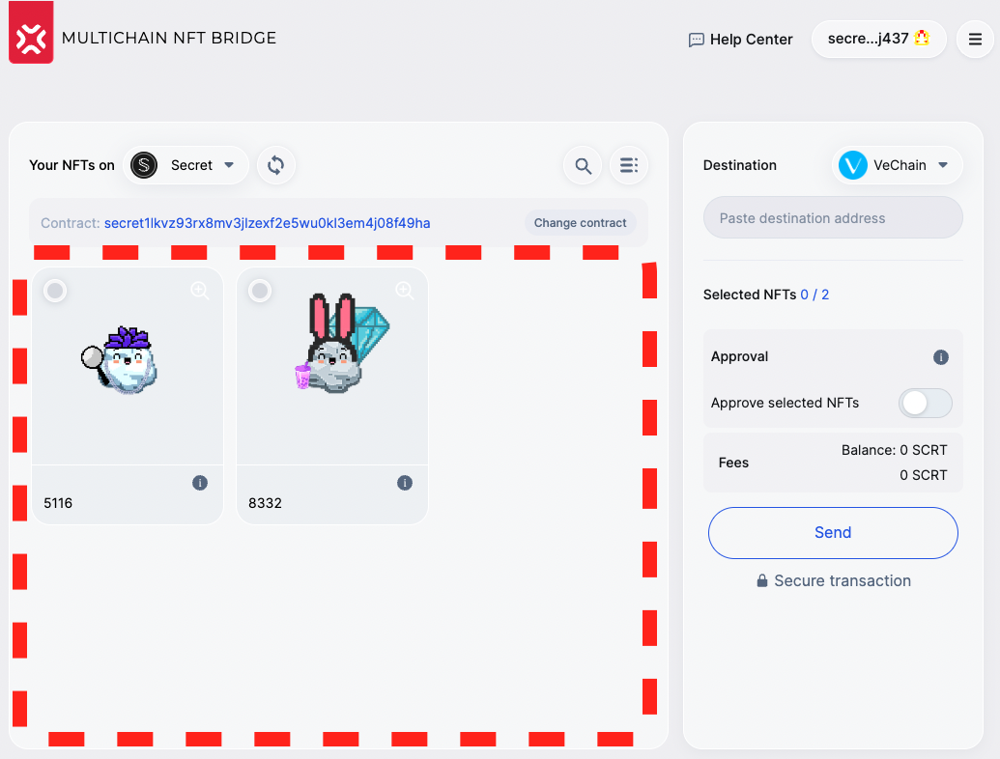
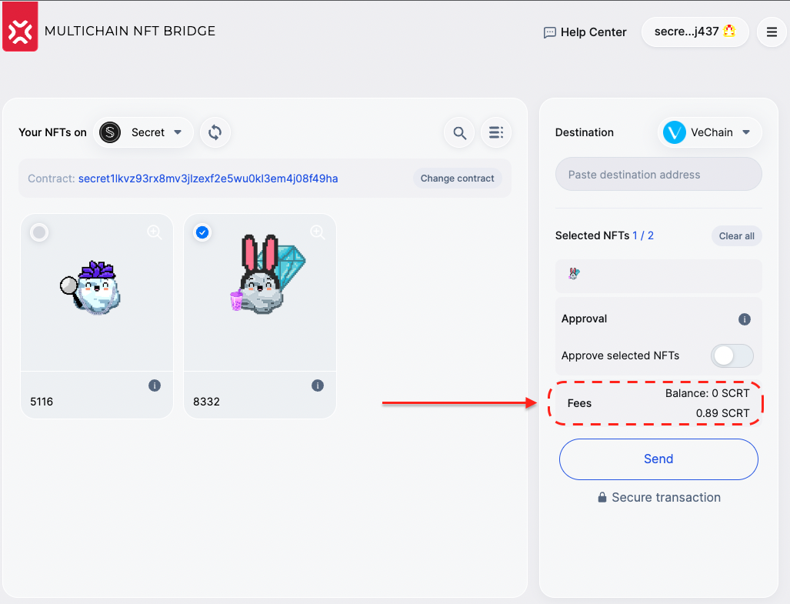
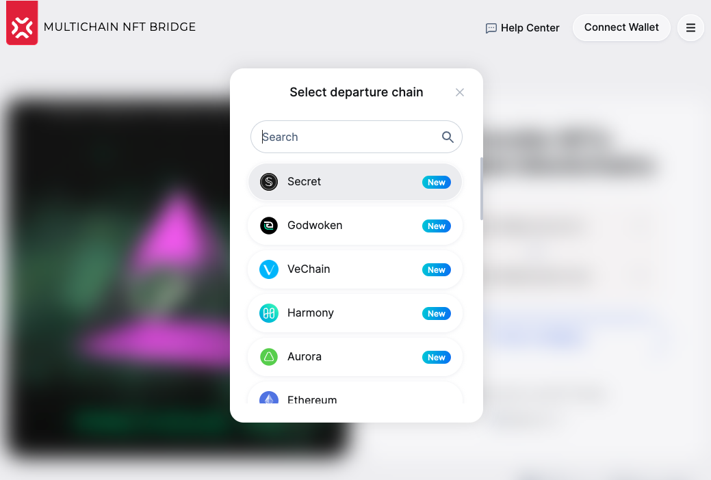
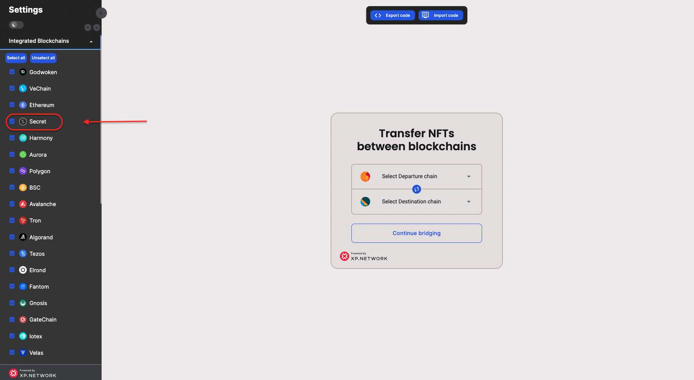

# Secret Network Grant Delivery Report

### `Milestone 1` — Smart Contract Development

| Length | Deliverable | Specification |
|-|-|-|
| 1 month | Smart Contracts | 0. We have researched the Secret Network [standards](https://scrt.network/about/secret-nfts) and other factors & [protocols](https://docs.scrt.network/dev/privacy-model-of-secret-contracts.html) that distinguish it from other chains We have developed the smart contracts that can: 1. [Handle SC requests](https://github.com/XP-NETWORK/secret-bridge/blob/master/src/contract.rs#L574-L595) 2. [Freeze](https://github.com/XP-NETWORK/secret-bridge/blob/master/src/contract.rs#L348-L405)/[Unfreeze](https://github.com/XP-NETWORK/secret-bridge/blob/master/src/contract.rs#L224-L244) single `Native` NFTs and [Freeze](https://github.com/XP-NETWORK/secret-bridge/blob/master/src/contract.rs#L406-L473)/[Unfreeze](https://github.com/XP-NETWORK/secret-bridge/blob/master/src/contract.rs#L245-L280) in batches 3. [Mint](https://github.com/XP-NETWORK/secret-bridge/blob/master/src/contract.rs#L281-L306)/[Burn](https://github.com/XP-NETWORK/secret-bridge/blob/master/src/contract.rs#L474-L517) single and [Mint](https://github.com/XP-NETWORK/secret-bridge/blob/master/src/contract.rs#L307-L347)/[Burn](https://github.com/XP-NETWORK/secret-bridge/blob/master/src/contract.rs#L518-L572) in batches `wrapped` NFTs 4. [Withdraw](https://github.com/XP-NETWORK/secret-bridge/blob/master/src/contract.rs#L199-L218) the TX fees on the target chain in native tokens|

### `Milestone 2` — Smart Contract Development

| Length | Deliverable | Specification |
|-|-|-|
| 0.5 month | Smart Contracts | We have developed the smart contracts that can: 5. [Trust/verify](https://github.com/XP-NETWORK/secret-bridge/blob/master/src/contract.rs#L53-L127) the multisig of the bridge oracle validators 6. [Whitelist](https://github.com/XP-NETWORK/secret-bridge/blob/master/src/contract.rs#L219-L223) NFT smart contracts 7. [Pause/Unpause](https://github.com/XP-NETWORK/secret-bridge/blob/master/src/contract.rs#L184-L189) for maintenance or if compromised 8. [Reset the Frost Group Key](https://github.com/XP-NETWORK/secret-bridge/blob/master/src/contract.rs#L190-L198) the bridge validators their expenses|

### `Milestone 3` — Testing & Documenting

| Length | Deliverable | Specification |
|-|-|-|
| 0.5 month | Tests & Documentation | 1. [Inline documentation of the code](https://github.com/XP-NETWORK/secret-bridge/commit/2ff8f610a8b905796a5d8fc626e26dd322b4de76) 2. [SC Functional tests](https://github.com/XP-NETWORK/secret-bridge/blob/master/src/tests.rs) 3. [Basic tutorial](https://github.com/XP-NETWORK/testing-secret_network) that can [interact](https://secretnodes.com/secret/chains/pulsar-2/contracts/secret146snljq0kjsva7qrx4am54nv3fhfaet7srx4n2) with the deployed [smart contracts](https://github.com/XP-NETWORK/xpjs/blob/secretjs/src/factory/factories.ts#L267-L280) and backend service. 4. [Testing the contracts in the testnet environment](https://github.com/XP-NETWORK/testing-secret_network#minting-an-nft-on-secret)|

### `Milestone 4` — Integrating into the Live Bridge
| Length | Deliverable | Specification |
|-|-|-|
| 1 month | Validators, Backend, Frontend | 1. Developing [validation logic](#41-validators-results) relevant for the Secret Network part of the bridge 2. Adding Secret Network to the [Bridge NFT-Indexer](#42-nft-indexing) 3. Integrating [TX fee estimation](#43-fee-estimation) 4. Plugging Secret Network in the [heartbeat](#44-heartbeat) 5. Integrating with a Secret Network [RPC nodes](#45-integrated-rpc-nodes) 6. Integrating Secret Network in the [bridge UI](#46-secret-in-the-bridge-ui) 7. Deploying [smart contracts](#47-mainnet-contracts) 8. Adding Secret Network to the bridge [JS library](#48-javascript-library) 9. Adding Secret Network to the [Bridge widget](#49-adding-secret-into-the-bridge-widget) 10. Adding support for [Keplr wallet](#410-support-fro-kepl-wallet)|

### 4.1 Validators results

All the transactions go through the bridge validators. Proper validation and off-chain multisignature validity are required for a transaction to successfully go through.

### 4.2 NFT Indexing

By contrast with most other chains, viewing NFTs in Secret is restricted to the asset owners via the `View Key`.

In order to view the NFTs on Secret proper indexing is required:

The working area with `NFT Cards` displays the tokens and allows to inspect the metadata attributes of a token or select it for transferring to another chain.

### 4.3 Fee estimation

To estimate the costs of transferring on the chain of destination (but charged in the native coins of the chain of departure) - a user needs to select one or multiple NFTs by clicking their NFT cards.

### 4.4 Heartbeat

Heartbeat tool checks:
1. Godwoken nodes are alive & respond normally
2. That the validators have  non zero balance

In case, one of the two is false, the chain is disabled in the UI to prevent tokens from getting stuck.

### 4.5 Integrated RPC nodes

Testnet: https://pulsar-2.api.trivium.network:9091/

Mainnet: https://secret-4.api.trivium.network:9091

### 4.6 Secret in the bridge UI

secret Network has been integrated in the Bridge UI and is available for selection as a chain of `Departure` or `Destination`.

### 4.7 Mainnet contracts

Bridge: `secret18f66qjjuyudmh7q6s50hwpt9y679lanjs82jkg`

XPNFT (default contract): `secret16zcej6asqrtfq08u3fdjhs03zpl7lgy7q32eps`

### 4.8 JavaScript Library

https://github.com/XP-NETWORK/xpjs/search?q=secret

### 4.9 Adding Secret into the Bridge Widget

### 4.10 Support fro Kepl wallet

Users can sign transactions via the Kepl wallet.

